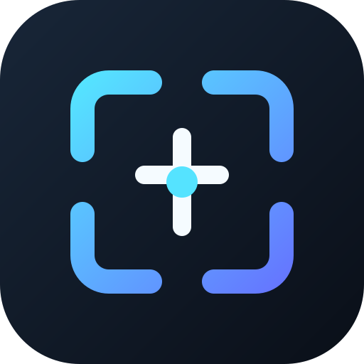
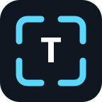
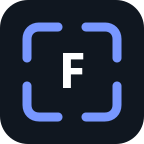

# ContextDeck

<div align="center">
  
</div>

<div align="center">
  
  
  
  
</div>

<p align="center">
  
  
  
  
  
</p>

<p align="center">
  <a href="https://github.com/sponsors/ChromuSx"></a>
  <a href="https://ko-fi.com/chromus"></a>
  <a href="https://buymeacoffee.com/chromus"></a>
  <a href="https://www.paypal.com/paypalme/giovanniguarino1999"></a>
</p>

<p align="center">
  <strong>ContextDeck automatically shows a configurable Stream Deck profile for the kind of content currently selected on Windows.</strong>
</p>

<div align="center">
  
  
  
  
</div>

## What it does

Select text, a file, a folder, or an image file and ContextDeck switches every
enabled Stream Deck device to the matching profile. Clear the selection and it
returns to the previous profile.

The four bundled profiles are deliberately empty and editable. ContextDeck
provides the context; users decide which actions belong on each key.

## Features

- Automatically detects non-empty text selections through Windows UI Automation.
- Detects selected files and folders in Windows File Explorer.
- Classifies image files separately from other files.
- Switches multiple supported Stream Deck devices.
- Returns to the previous profile after the selection is cleared.
- Installs empty, user-editable profiles without preconfigured actions.
- Includes an optional `ContextDeck Control` action for status, pause/resume, and settings.
- Uses a Stream Deck-style Property Inspector with automatic saving.
- Supports per-context toggles, target devices, timing, and application exclusions.
- Uses a self-contained native helper; end users do not need to install .NET.

## Context profiles

| Selection | Profile |
| --- | --- |
| Non-empty selected text | `ContextDeck — Text` |
| Selected file | `ContextDeck — File` |
| Selected folder | `ContextDeck — Folder` |
| Selected image file | `ContextDeck — Image` |

The package contains one set for every supported device layout. Stream Deck
installs only the profiles compatible with the connected device.

## Supported devices

| Device | Support |
| --- | :---: |
| Stream Deck / Stream Deck MK.2 | ✅ |
| Stream Deck Mini | ✅ |
| Stream Deck XL | ✅ |
| Stream Deck Mobile | ✅ |
| Stream Deck + | ✅ |
| Stream Deck Neo | ✅ |

## Requirements

- Windows 10 or Windows 11
- Stream Deck software 6.9 or newer
- A supported Stream Deck device or Stream Deck Mobile

## Installation

### GitHub Releases

Prebuilt releases are coming soon.

### Build from source

```powershell
git clone https://github.com/ChromuSx/ContextDeck.git
cd ContextDeck\streamdeck-plugin
npm install
npm run build:package
```

Then double-click:

```text
streamdeck-plugin/com.chromusx.contextdeck.streamDeckPlugin
```

Accept the Stream Deck prompt to install the bundled profiles.

## Quick start

1. Install ContextDeck and accept the profile installation prompt.
2. Open Stream Deck settings and customize the four ContextDeck profiles.
3. Select text in an application or select an item in File Explorer.
4. ContextDeck opens the matching profile automatically.
5. Clear the selection to return to the profile that was active before.
6. Optionally add `ContextDeck Control` from the actions list to any key.

## Settings

The optional `ContextDeck Control` action opens the Property Inspector:

- Enable or pause automatic switching.
- Enable individual context types.
- Choose whether image files use the Image or File profile.
- Adjust switch, return, and detection timing.
- Select target devices.
- Exclude foreground applications by executable name.

Settings are global and saved automatically.

## Privacy

ContextDeck does not send selected content to the plugin or to a remote service.
The native Windows helper reports only:

- the selection category;
- the foreground process name;
- the detection source and confidence;
- a timestamp.

Selected text, file paths, filenames, and file contents are never serialized by
the helper.

## How it works

1. A self-contained .NET helper observes the foreground selection.
2. It emits a privacy-safe category such as `text`, `file`, `folder`, or `image-file`.
3. The TypeScript plugin maps the category to the profile for each connected device.
4. Stream Deck switches to the bundled editable profile through the official SDK.
5. When the selection disappears, ContextDeck requests the previous profile.

## Limitations

- ContextDeck currently supports Windows only.
- Text selection depends on the accessibility information exposed by the foreground application.
- File, folder, and image-file detection currently targets Windows File Explorer.
- The Stream Deck SDK permits plugins to switch only to profiles bundled with
  the plugin. ContextDeck cannot select arbitrary user-created profiles.
- Profiles already imported and edited by a user are not overwritten by plugin
  updates.

## Development

### Prerequisites

- Node.js 20+
- npm
- .NET 8 SDK
- Windows 10/11

### Commands

```powershell
cd streamdeck-plugin
npm install
npm test
npm run build
npm run validate
npm run package
```

`npm run build:package` performs the complete build and packaging workflow.

## Project structure

```text
ContextDeck/
  streamdeck-plugin/
    native/ContextDeck.Helper/  Windows selection monitor
    profiles/templates/        Device-specific profile containers
    scripts/                   Build, generation, validation, and packaging
    src/                       Stream Deck WebSocket runtime
    test/                      Runtime unit tests
    ui/                        Property Inspector
```

## Troubleshooting

### Profiles are missing

- Confirm the profile-installation prompt was accepted.
- Make sure the connected device is listed in the supported devices table.
- Reinstalling does not overwrite profiles that Stream Deck already imported.
- Check Stream Deck logs for profile import errors when developing locally.

### Text selection is not detected

- Try the same selection in Notepad to confirm Windows UI Automation support.
- Applications running as administrator may not be inspectable by a non-elevated Stream Deck process.
- Add or remove the application from the exclusion list in the Property Inspector.

### File or folder selection is not detected

- Make sure File Explorer is the foreground window.
- Select one or more filesystem items rather than navigation-pane shortcuts.

## Support and contributions

- Read [SUPPORT.md](SUPPORT.md) before opening a support request.
- Report reproducible bugs through [GitHub Issues](https://github.com/ChromuSx/ContextDeck/issues).
- See [CONTRIBUTING.md](CONTRIBUTING.md) for development and pull-request guidance.
- Security reports should follow [SECURITY.md](SECURITY.md).

## Support the project

ContextDeck is free and open source. If it improves your Stream Deck workflow,
you can support continued development:

<div align="center">
  <a href="https://github.com/sponsors/ChromuSx"></a>
  <a href="https://ko-fi.com/chromus"></a>
  <a href="https://buymeacoffee.com/chromus"></a>
  <a href="https://www.paypal.com/paypalme/giovanniguarino1999"></a>
</div>

## License

ContextDeck is licensed under the [MIT License](LICENSE). Third-party notices
are listed in [THIRD_PARTY_NOTICES.md](THIRD_PARTY_NOTICES.md).

ContextDeck is an independent project and is not affiliated with or endorsed by
Elgato or Corsair.

---

<div align="center">
  <sub>Made by <a href="https://github.com/ChromuSx">Giovanni Guarino</a></sub>
</div>
